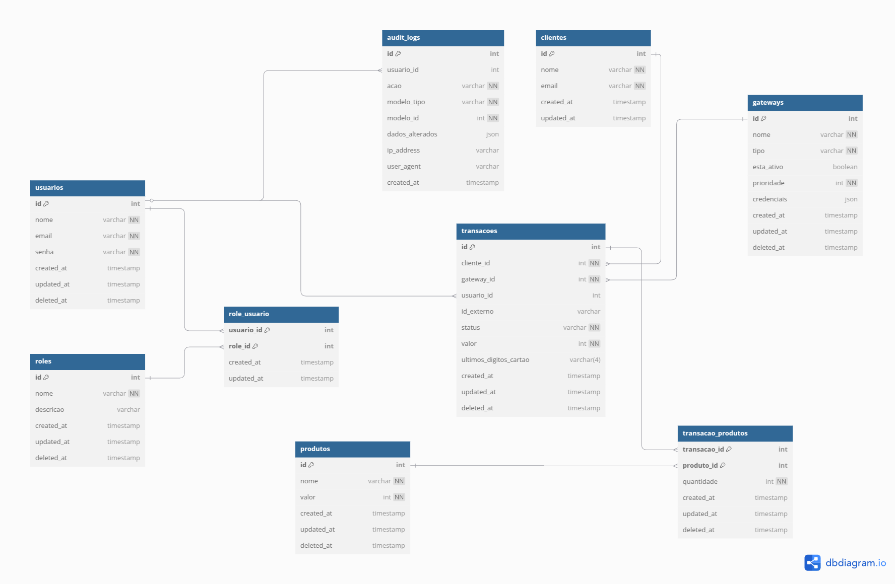

# Sistema de Pagamento Multi-Gateway


## 📋 Índice

- [Visão Geral](#visão-geral)
- [Funcionalidades](#funcionalidades)
- [Arquitetura e Design](#arquitetura-e-design)
- [Estrutura do Banco de Dados](#estrutura-do-banco-de-dados)
- [Requisitos](#requisitos)
- [Instalação e Configuração](#instalação-e-configuração)
- [API Endpoints](#api-endpoints)
- [Documentação e Testes da API](#documentação-e-testes-da-api)
- [Autenticação e Autorização](#autenticação-e-autorização)
- [Processamento de Pagamentos](#processamento-de-pagamentos)
- [Testes Automatizados](#testes-automatizados)
- [Monitoramento e Observabilidade](#monitoramento-e-observabilidade)
- [Extensibilidade](#extensibilidade)
- [Solução de Problemas](#solução-de-problemas)
- [Contribuindo](#contribuindo)
- [Licença](#licença)

## Visão Geral

Esta solução implementa um sistema de pagamento multi-gateway, permitindo processamento de transações comerciais através de diferentes provedores de pagamento. O sistema tenta processar os pagamentos seguindo uma ordem de prioridade definida, e em caso de falha em um gateway, tenta automaticamente o próximo disponível.

### Problema Resolvido

O desafio principal que este sistema resolve é a dependência de um único gateway de pagamento, o que pode resultar em falhas de processamento quando este gateway está indisponível ou rejeita uma transação. Ao implementar múltiplos gateways com fallback automático, garantimos maior disponibilidade e taxa de sucesso nas transações.

### Abordagem Técnica

O sistema foi desenvolvido como uma API RESTful com Laravel 12, utilizando princípios de design SOLID, TDD (Test-Driven Development) e arquitetura em camadas. A solução é containerizada com Docker para facilitar o desenvolvimento e implantação.

## Funcionalidades

### Principais Recursos

- **Processamento Multi-Gateway**: Tentativa automática em múltiplos gateways de pagamento seguindo ordem de prioridade.
- **Fallback Automático**: Em caso de falha, o sistema tenta o próximo gateway disponível sem interrupção.
- **Controle de Acesso por Roles**: Sistema com 4 níveis de acesso (ADMIN, MANAGER, FINANCE, USER).
- **Gestão de Produtos e Clientes**: Cadastro e gerenciamento completo de produtos e clientes.
- **Histórico de Transações**: Registro detalhado de todas as transações realizadas.
- **Processamento de Reembolsos**: Capacidade de processar devoluções diretamente nos gateways.
- **API RESTful Completa**: Endpoints bem definidos para todas as operações.
- **Observabilidade**: Monitoramento avançado via Laravel Telescope.

## Arquitetura e Design

O sistema segue uma arquitetura de camadas com princípios SOLID:

```
┌─────────────────────────────────────────────────────────────┐
│                       API Controllers                       │
└───────────────────────────────┬─────────────────────────────┘
                                │
┌───────────────────────────────▼─────────────────────────────┐
│                         Services                            │
│                                                             │
│  ┌───────────────────┐    ┌────────────────────────────┐    │ 
│  │  PaymentService   │───►│    Gateway Interface       │    │
│  └───────────────────┘    └────────────────────────────┘    │
│                                     ▲                       │
│                       ┌─────────────┼──────────────┐        │
│                       │             │              │        │
│              ┌────────▼─────┐ ┌─────▼────────┐ ┌───▼───┐    │
│              │  Gateway 1   │ │  Gateway 2   │ │  ...  │    │
│              └──────────────┘ └──────────────┘ └───────┘    │
└─────────────────────────────────────────────────────────────┘
                                │
┌───────────────────────────────▼─────────────────────────────┐
│                         Models / ORM                        │
└─────────────────────────────────────────────────────────────┘
```

- **Controllers**: Responsáveis por receber as requisições HTTP, validar os dados e retornar respostas adequadas.
- **Services**: Contêm a lógica de negócio, incluindo o `PaymentService` que orquestra o processamento de pagamentos entre gateways.
- **Gateways**: Implementações específicas para cada provedor de pagamento, seguindo uma interface comum.
- **Models**: Representam as entidades do banco de dados e encapsulam a lógica de acesso aos dados.

### Padrões de Design Utilizados

- **Strategy Pattern**: Para selecionar diferentes gateways de pagamento
- **Repository Pattern**: Para abstrair o acesso aos dados
- **Factory Pattern**: Para criação de objetos complexos
- **Dependency Injection**: Para desacoplamento de componentes

## Estrutura do Banco de Dados

### Modelo Entidade-Relacionamento (ER)

O sistema utiliza um banco de dados relacional MySQL com a seguinte estrutura:



### Principais Entidades

- **Usuários**: Administradores e operadores do sistema com diferentes níveis de permissão
- **Roles**: Papéis de acesso (ADMIN, MANAGER, FINANCE, USER)
- **Clientes**: Compradores que realizam transações
- **Gateways**: Provedores de pagamento configurados no sistema
- **Produtos**: Itens disponíveis para venda
- **Transações**: Registros de pagamentos processados

### Cardinalidade dos Relacionamentos

- **Usuário-Role**: N:M (Muitos para Muitos) - Um usuário pode ter várias roles e uma role pode pertencer a vários usuários
- **Cliente-Transação**: 1:N (Um para Muitos) - Um cliente pode ter várias transações
- **Gateway-Transação**: 1:N (Um para Muitos) - Um gateway pode processar várias transações
- **Usuário-Transação**: 1:N (Um para Muitos) - Um usuário pode registrar/gerenciar várias transações
- **Transação-Produto**: N:M (Muitos para Muitos) - Uma transação pode incluir vários produtos e um produto pode estar em várias transações

### Normalização e Integridade

O esquema foi projetado seguindo os princípios de normalização para evitar redundância e manter a integridade dos dados:

- Todas as tabelas incluem controle de timestamps (created_at, updated_at)
- As tabelas principais implementam soft delete (deleted_at) para preservar histórico
- Índices são utilizados nas colunas mais consultadas para otimizar a performance
- Constraints de chave estrangeira garantem a integridade referencial

## Requisitos

### Para Desenvolvimento:

- Docker e Docker Compose
- Git
- Composer

### Para Produção:

- Servidor Web (Nginx/Apache)
- PHP 8.2+
- MySQL 8.0+
- Redis (opcional, para cache)
- Composer

## Instalação e Configuração

### Usando Docker (Recomendado):

1. Clone o repositório:
   ```bash
    git clone https://github.com/DanielTrindade/multigateway-api.git
    cd multigateway-api
   ```
2. Faça a instalação das dependências do Laravel:
   ```bash
    composer install -d multigateway-app
   ```
3. Execute o script de setup:
   ```bash
   ./setup.sh
   ```
   
   Ou para usuários Windows ou alternativamente:
   ```bash
   python setup.py
   ```

4. Acesse a aplicação:
   - Web: http://localhost:8000
   - API: http://localhost:8000/api
   - Gateway 1 Mock: http://localhost:3001
   - Gateway 2 Mock: http://localhost:3002

### Configuração Manual (Sem Docker):

1. Clone o repositório e instale as dependências:
   ```bash
   git clone https://github.com/DanielTrindade/multigateway-api.git
   cd multigateway-api/multigateway-app
   composer install
   ```

2. Configure o arquivo `.env`:
   ```bash
   cp .env.example .env
   php artisan key:generate
   ```

3. Configure o banco de dados no `.env` e execute as migrações:
   ```bash
   php artisan migrate --seed
   ```

4. Inicie o servidor de desenvolvimento:
   ```bash
   php artisan serve
   ```

5. Configure e inicie os mocks dos gateways de pagamento:
   ```bash
   docker run -p 3001:3001 -p 3002:3002 matheusprotzen/gateways-mock
   ```

## API Endpoints

A seguir, estão os principais endpoints da API. Todas as respostas são em formato JSON.

### Autenticação:

| Método | Endpoint        | Descrição                     | Acesso      |
|--------|-----------------|-------------------------------|-------------|
| POST   | `/api/login`    | Realizar login e obter token  | Público     |
| POST   | `/api/register` | Registrar novo usuário        | Público     |
| POST   | `/api/logout`   | Encerrar sessão               | Autenticado |
| GET    | `/api/user`     | Obter dados do usuário atual  | Autenticado |

### Transações:

| Método | Endpoint                        | Descrição                     | Acesso         |
|--------|---------------------------------|-------------------------------|----------------|
| POST   | `/api/purchase`                 | Realizar uma compra           | Público        |
| GET    | `/api/transactions`             | Listar todas as transações    | Autenticado    |
| GET    | `/api/transactions/{id}`        | Ver detalhes de uma transação | Autenticado    |
| POST   | `/api/transactions/{id}/refund` | Reembolsar uma transação      | ADMIN, FINANCE |

### Gateways:

| Método | Endpoint                      | Descrição                        | Acesso      |
|--------|-------------------------------|----------------------------------|-------------|
| GET    | `/api/gateways`               | Listar todos os gateways         | Autenticado |
| GET    | `/api/gateways/{id}`          | Ver detalhes de um gateway       | Autenticado |
| POST   | `/api/gateways`               | Criar novo gateway               | ADMIN       |
| PUT    | `/api/gateways/{id}`          | Atualizar gateway                | ADMIN       |
| DELETE | `/api/gateways/{id}`          | Remover gateway                  | ADMIN       |
| PATCH  | `/api/gateways/{id}/toggle`   | Ativar/desativar gateway         | ADMIN       |
| PATCH  | `/api/gateways/{id}/priority` | Atualizar prioridade             | ADMIN       |

### Produtos:

| Método | Endpoint             | Descrição                 | Acesso                  |
|--------|----------------------|---------------------------|-------------------------|
| GET    | `/api/products`      | Listar todos os produtos  | Autenticado             |
| GET    | `/api/products/{id}` | Ver detalhes de um produto| Autenticado             |
| POST   | `/api/products`      | Criar novo produto        | ADMIN, MANAGER, FINANCE |
| PUT    | `/api/products/{id}` | Atualizar produto         | ADMIN, MANAGER, FINANCE |
| DELETE | `/api/products/{id}` | Remover produto           | ADMIN, MANAGER, FINANCE |

### Clientes:

| Método | Endpoint                         | Descrição                  | Acesso      |
|--------|----------------------------------|----------------------------|-------------|
| GET    | `/api/clients`                   | Listar todos os clientes   | Autenticado |
| GET    | `/api/clients/{id}`              | Ver detalhes de um cliente | Autenticado |
| GET    | `/api/clients/{id}/transactions` | Ver transações do cliente  | Autenticado |

### Usuários:

| Método | Endpoint               | Descrição                    | Acesso         |
|--------|------------------------|------------------------------|----------------|
| GET    | `/api/users`           | Listar todos os usuários     | ADMIN, MANAGER |
| GET    | `/api/users/{id}`      | Ver detalhes de um usuário   | ADMIN, MANAGER |
| POST   | `/api/users`           | Criar novo usuário           | ADMIN, MANAGER |
| PUT    | `/api/users/{id}`      | Atualizar usuário            | ADMIN, MANAGER |
| DELETE | `/api/users/{id}`      | Remover usuário              | ADMIN, MANAGER |
| PATCH  | `/api/users/{id}/role` | Atualizar role de um usuário | ADMIN          |

## Documentação e Testes da API

### Collection do Postman

Para facilitar o teste e a exploração da API, disponibilizei uma Collection do Postman completa com todos os endpoints configurados.

#### Como usar:

1. Baixe e instale o [Postman](https://www.postman.com/downloads/)
2. Importe a collection usando um dos métodos abaixo:
   
   **Importar do arquivo na raiz**: Importe o arquivo da collection
   - O arquivo `MultiGateway API.postman_collection.json` está na raiz do projeto
   - No Postman, clique em File > Import > Upload Files e selecione o arquivo

3. Configure as variáveis de ambiente:
   - Crie um ambiente no Postman (Manage Environments)
   - Adicione a variável `base_url` com valor `http://localhost:8000/api`
   - Adicione uma variável vazia `auth_token` (será preenchida automaticamente ao fazer login)

4. Execute as requisições na seguinte ordem para testes:
   - Use primeiro os endpoints de Autenticação para obter um token
   - O token será automaticamente armazenado e utilizado em todas as outras requisições

A collection inclui todos os endpoints necessários para testar completamente a API do sistema multi-gateway, com exemplos de requisições e respostas para cada funcionalidade.

## Autenticação e Autorização

O sistema utiliza Laravel Sanctum para autenticação baseada em tokens. A autorização é feita através de um sistema de roles:

### Roles:

1. **ADMIN**: Acesso completo a todas as funcionalidades do sistema
2. **MANAGER**: Pode gerenciar produtos e usuários
3. **FINANCE**: Pode gerenciar produtos e realizar reembolsos
4. **USER**: Acesso básico para visualização (padrão para novos usuários)

### Exemplo de Autenticação:

```bash
# Obter token de acesso
curl -X POST http://localhost:8000/api/login \
  -H "Content-Type: application/json" \
  -d '{"email":"admin@example.com","password":"password"}'

# Usar o token para acessar endpoints protegidos
curl -X GET http://localhost:8000/api/transactions \
  -H "Authorization: Bearer {seu_token_aqui}"
```

### Usuários Padrão:

O sistema é pré-configurado com os seguintes usuários:

| Email               | Senha    | Role    |
|---------------------|----------|---------|
| admin@example.com   | password | ADMIN   |
| manager@example.com | password | MANAGER |
| finance@example.com | password | FINANCE |
| user@example.com    | password | USER    |

## Processamento de Pagamentos

### Fluxo de Processamento:

1. Cliente envia solicitação de compra com produtos, quantidade e dados de pagamento
2. Sistema calcula o valor total com base nos produtos e quantidades
3. Sistema tenta processar o pagamento no gateway de maior prioridade
4. Em caso de falha, o sistema tenta o próximo gateway disponível
5. Ao obter sucesso, registra a transação e retorna o resultado

### Exemplo de Solicitação de Pagamento:

```json
POST /api/purchase

{
  "products": [
    {"id": 1, "quantity": 2},
    {"id": 3, "quantity": 1}
  ],
  "client_name": "João Silva",
  "client_email": "joao.silva@gmail.com",
  "card_number": "5569000000006063",
  "card_cvv": "010"
}
```

### Resposta de Sucesso:

```json
{
  "message": "Compra realizada com sucesso",
  "transaction": {
    "id": 123,
    "external_id": "tx-f8g9h0j1k2l3",
    "status": "COMPLETED",
    "amount": 3500,
    "amount_formatted": "R$ 35,00",
    "card_last_numbers": "6063",
    "client": {
      "id": 45,
      "name": "João Silva",
      "email": "joao.silva@gmail.com"
    },
    "products": [
      {
        "id": 1,
        "name": "Produto 1",
        "amount": 1000,
        "amount_formatted": "R$ 10,00",
        "pivot": {
          "quantity": 2,
          "subtotal": 2000,
          "subtotal_formatted": "R$ 20,00"
        }
      },
      {
        "id": 3,
        "name": "Produto Premium",
        "amount": 1500,
        "amount_formatted": "R$ 15,00",
        "pivot": {
          "quantity": 1,
          "subtotal": 1500,
          "subtotal_formatted": "R$ 15,00"
        }
      }
    ]
  }
}
```

## Testes Automatizados

O projeto segue a metodologia TDD (Test-Driven Development) e conta com testes unitários e de integração.

### Executando os Testes:

```bash
# No ambiente Docker
./run-tests.sh

# Ou para usuários Windows ou alternativamente:
python run_tests.py

# Executar testes específicos
./run-tests.sh --filter=NomeDoTeste
```

### Cobertura de Testes:

- **Testes Unitários**: Classes de serviços e models
- **Testes de Feature**: Endpoints da API e fluxos de integração
- **Testes de Integração**: Comunicação com gateways de pagamento

## Monitoramento e Observabilidade

O sistema utiliza o Laravel Telescope para monitoramento e observabilidade em tempo real.

### Recursos do Telescope:

- Monitoramento de requisições HTTP
- Logs de queries do banco de dados
- Monitoramento de jobs e filas
- Logs de erros e exceções
- Logs de envio de emails
- Monitoramento de eventos

### Acesso ao Telescope:

O dashboard do Telescope está disponível em `/telescope` (por exemplo, http://localhost:8000/telescope) e só pode ser acessado por usuários com permissão de ADMIN.

### Logs Estruturados:

Além do Telescope, o sistema utiliza logs estruturados para rastreamento de operações críticas:

- Transações de pagamento (sucesso/falha)
- Tentativas de autenticação
- Erros de comunicação com gateways
- Criação/modificação de recursos

```bash
# Visualizar logs no ambiente Docker
docker-compose exec app tail -f storage/logs/laravel.log
```

## Extensibilidade

O sistema foi projetado para ser facilmente extensível, permitindo adicionar novos gateways de pagamento com mínimas alterações no código.

### Adicionando um Novo Gateway:

1. Crie uma nova classe que implemente a interface `PaymentGatewayInterface`
2. Adicione o novo gateway ao método `getGatewayInstance` no `PaymentService`
3. Adicione as configurações necessárias ao `.env` e `config/services.php`

Exemplo de implementação:

```php
// app/Services/Payment/NewGateway.php
namespace App\Services\Payment;

class NewGateway implements PaymentGatewayInterface
{
    public function pay(array $data): array
    {
        // Implementação do método pay
    }

    public function refund(string $transactionId): array
    {
        // Implementação do método refund
    }

    public function getTransactions(): array
    {
        // Implementação do método getTransactions
    }
}
```

## Solução de Problemas

### Problemas Comuns:

#### 1. Erros de conexão com o banco de dados

**Solução**: Verifique se o serviço MySQL está rodando e se as credenciais no `.env` estão corretas.

```bash
# Verificar status do MySQL
docker-compose ps db

# Verificar logs
docker-compose logs db
```

#### 2. Erros de comunicação com os gateways

**Solução**: Verifique se os serviços de gateway mock estão rodando.

```bash
# Verificar status dos gateways
docker-compose ps gateway1 gateway2

# Reiniciar os gateways
docker-compose restart gateway1 gateway2
```

#### 3. Permissões de arquivos

**Solução**: Ajuste as permissões dos diretórios de storage e bootstrap/cache.

```bash
# No ambiente Docker
docker-compose exec app chmod -R 775 storage bootstrap/cache
docker-compose exec app chown -R www-data:www-data storage bootstrap/cache
```

#### 4. Resetar completamente o ambiente

Se precisar limpar todo o ambiente e começar do zero:

```bash
# Usando o script de limpeza
./docker-clean.sh

# Ou para usuários Windows ou alternativamente:
python docker_clean.py

# E depois reinstale
./setup.sh
# ou
python setup.py
```
## Licença

Este projeto está licenciado sob a [MIT License](LICENSE).

---

**© 2025 Daniel Trindade - Sistema de Pagamento Multi-Gateway**